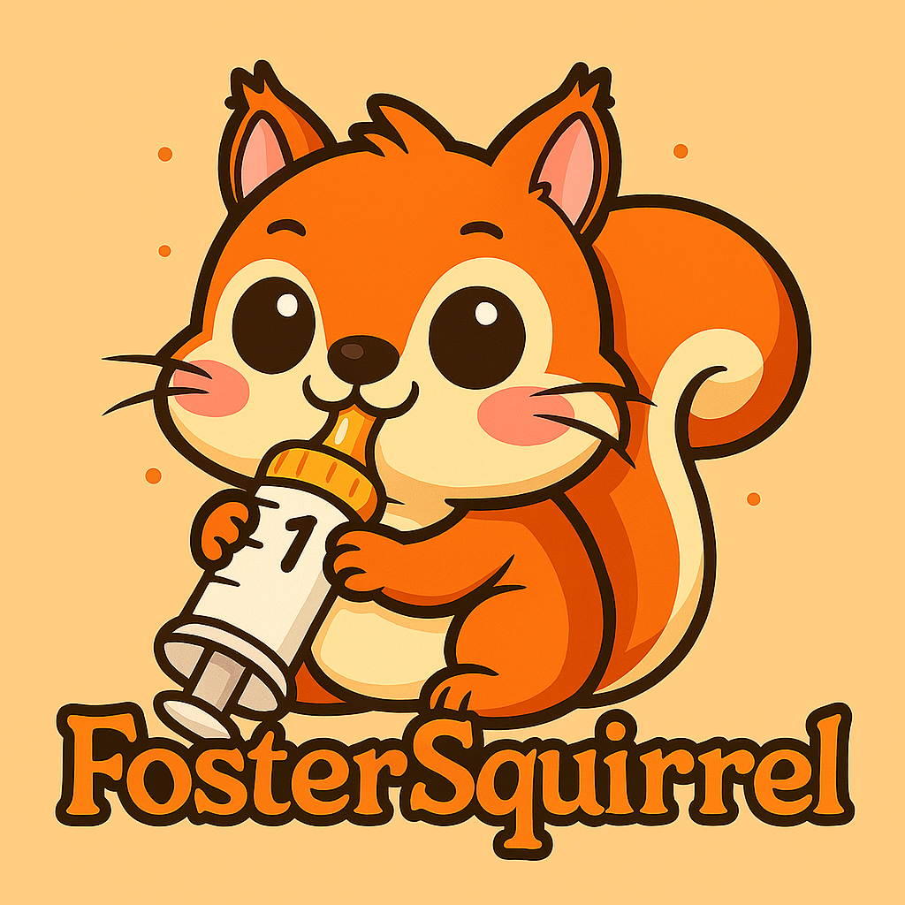

# 🐿️ FosterSquirrel

A Flutter app designed for wildlife rehabilitators to track baby squirrels' feeding schedules, weight records, and care progress with accurate, age-based feeding calculations.



## 🎯 Features

### Core Functionality
- **Squirrel Management**: Add, edit, and track individual baby squirrels
- **Feeding Schedules**: Age and weight-based feeding calculations (in mL)
- **Feeding Records**: Track feeding times, amounts, and notes
- **Progress Tracking**: Monitor weight gain and development milestones
- **Offline-First**: All data stored locally, no internet required

### User Experience
- **Intuitive Interface**: Simple, focused design for quick data entry
- **Real-time Updates**: Live feeding amount calculations based on age/weight
- **Comprehensive History**: View feeding patterns and growth trends
- **Production-Ready**: Robust database migrations preserve data across updates

## 🚀 Getting Started

### Prerequisites
- [Flutter SDK](https://flutter.dev/docs/get-started/install) (3.9.2 or higher)
- [Android Studio](https://developer.android.com/studio) or [VS Code](https://code.visualstudio.com/)
- Android emulator or physical device

### Installation

1. **Clone the repository**
   ```bash
   git clone https://github.com/your-username/foster_squirrel.git
   cd foster_squirrel
   ```

2. **Install dependencies**
   ```bash
   flutter pub get
   ```

3. **Run the app**
   ```bash
   flutter run
   ```

### Quick Start with VS Code

## 🚀 **RELIABLE DEPLOYMENT GUIDE**

### **Method 1: VS Code Tasks (Recommended)**

**Step-by-step for reliable deployment:**

1. **First Time Setup**
   - Press **Ctrl+Shift+P** → "Tasks: Run Task" → **"🔍 Check Devices"**
   - Verify your Android emulator shows up as `emulator-5554`

2. **Quick Development (Most Common)**
   - Press **Ctrl+Shift+P** → "Tasks: Run Task" → **"🚀 Quick Start (Debug)"**
   - This auto-selects the best available device and starts with hot reload

3. **Force Android Deployment**
   - Press **Ctrl+Shift+P** → "Tasks: Run Task" → **"📱 Deploy to Android"**
   - Explicitly targets your Android emulator

4. **If Having Issues**
   - Press **Ctrl+Shift+P** → "Tasks: Run Task" → **"🔧 Full Reset & Deploy"**
   - This cleans everything and does a fresh build

### **Method 2: VS Code Debug Launch**
- Press **F5** to start debugging (uses default launch configuration)
- This is the fastest method once everything is set up

### **Method 3: Command Line**
```bash
# Quick check what's available
flutter devices

# Deploy to any available device
flutter run --debug

# Force deploy to Android emulator specifically
flutter run --debug -d emulator-5554

# If you get build errors, clean first
flutter clean && flutter pub get && flutter run --debug -d emulator-5554
```

### **Troubleshooting Common Issues**

| Problem | Solution |
|---------|----------|
| "No devices found" | Run **"🔍 Check Devices"** task or `flutter devices` |
| Build errors | Run **"🔧 Full Reset & Deploy"** task |
| Emulator not responding | Kill and restart: `adb emu kill` then restart emulator |
| Dependencies issues | Run **"📦 Install Dependencies"** task |
| Code not updating | Press **'r'** in Flutter terminal for hot reload, **'R'** for hot restart |

### **Available VS Code Tasks**

| Task | Description | When to Use |
|------|-------------|-------------|
| 🚀 **Quick Start (Debug)** | Auto-select device, start debug | **Most common - daily development** |
| 📱 **Deploy to Android** | Force Android emulator | When you have multiple devices |
| 🔧 **Full Reset & Deploy** | Clean build + deploy | When having build issues |
| 🔍 **Check Devices** | List available devices | To verify emulator is running |
| 🏗️ **Clean Build** | Clean cache + reinstall deps | When dependencies are corrupted |
| 🎯 **Profile Mode** | Performance testing | For performance analysis |
| 📋 **Release APK** | Build release APK | For final builds |

### **Hot Reload Commands (Once Running)**
- **'r'** = Hot reload (fast, preserves state)
- **'R'** = Hot restart (slower, resets state)
- **'q'** = Quit
- **'h'** = Help

## 📱 Usage

### Adding a Squirrel
1. Tap the **+** button on the home screen
2. Enter squirrel details (name, age, weight)
3. Save to create the squirrel profile

### Recording Feedings
1. Select a squirrel from the list
2. Tap the **+** button in the feeding tab
3. The app automatically calculates the proper feeding amount based on age and weight
4. Record actual amount fed and any notes

### Monitoring Progress
- View feeding history in the squirrel detail screen
- Track weight changes over time
- Monitor feeding frequency and amounts

## ⚡ Performance Optimizations

This app follows Flutter performance best practices for smooth 60fps operation:

### Build Method Optimization
- **Const constructors** throughout the widget tree for rebuild short-circuiting
- **Async initialization** prevents main thread blocking during app startup
- **Localized setState()** usage minimizes rebuild scope
- **StatelessWidget** preference over helper functions

### Image & Asset Optimization  
- **Custom OptimizedImages** with memory-efficient caching
- **Device pixel ratio** awareness for crisp rendering
- **FilterQuality optimization** balances quality and performance
- **Error fallbacks** with proper icon alternatives

### Database & Threading
- **Async database operations** keep UI responsive
- **Efficient queries** with proper indexing
- **Memory management** with proper resource disposal
- **Background processing** for heavy operations

### UI Rendering
- **Avoided intrinsic layouts** that require expensive measurements
- **Proper ListView.builder** usage for large lists
- **Minimized opacity operations** and expensive effects
- **Performance profiling** validates 16ms frame targets

## 🏗️ Architecture

### Technology Stack
- **Frontend**: Flutter/Dart
- **Database**: SQLite (sqflite)
- **State Management**: Provider
- **Testing**: Unit, Widget, and Integration tests

### Project Structure
```
lib/
├── main.dart                    # App entry point
├── models/                      # Data models
│   ├── squirrel.dart           # Squirrel entity
│   ├── feeding_record.dart     # Feeding record entity
│   └── feeding_schedule.dart   # Feeding calculation logic
├── services/                    # Core services
│   └── database_service.dart   # SQLite database management
├── repositories/                # Data access layer
│   ├── feeding_repository.dart
│   └── settings_repository.dart
├── views/                       # UI screens
│   ├── home/
│   └── squirrel_detail/
└── widgets/                     # Reusable components
    └── forms/
```

### Database Schema
- **squirrels**: Core squirrel information and current stats
- **feeding_records**: Historical feeding data with calculated amounts
- **app_settings**: User preferences and app configuration

## 🔧 Development

### Running Tests
```bash
# Run all tests
flutter test

# Run specific test suites
flutter test test/unit/
flutter test test/integration/
flutter test test/widget/
```

### Code Quality
- **Linting**: Uses flutter_lints for code standards
- **Testing**: Comprehensive unit, widget, and integration tests
- **Documentation**: All public APIs documented

### Database Migrations
The app uses a robust migration system that preserves user data:
- Incremental schema updates
- Data transformation and validation
- Error handling and rollback support
- Production-ready for device deployment

## 📊 Feeding Calculations

The app uses scientifically-based feeding schedules:

### Age-Based Feeding
- **0-1 weeks**: Very frequent, small amounts
- **2-4 weeks**: Regular feeding schedule
- **5-8 weeks**: Transitioning to solid food
- **9+ weeks**: Weaning phase

### Formula Calculations
- Feed amounts calculated in milliliters (mL)
- Based on age, weight, and development stage
- Adjustable for individual squirrel needs

## 🛠️ Development Scripts

Use VS Code tasks (similar to npm scripts) for common development tasks:

### Quick Commands (Ctrl+Shift+P → "Tasks: Run Task")

**Development:**
- **`dev`**: Run app in debug mode (`flutter run --debug`)
- **`dev:profile`**: Run app in profile mode for performance testing
- **`dev:cold-boot`**: Launch emulator and run app

**Building:**
- **`build`**: Build release APK (`flutter build apk`)
- **`build:debug`**: Build debug APK
- **`build:release`**: Build release APK

**Testing:**
- **`test`**: Run all tests
- **`test:unit`**: Run only unit tests
- **`test:integration`**: Run only integration tests

**Maintenance:**
- **`clean`**: Clean build artifacts
- **`install`**: Get dependencies (`flutter pub get`)
- **`clean-install`**: Clean and reinstall dependencies
- **`format`**: Format code (`dart format`)
- **`analyze`**: Run static analysis (`flutter analyze`)
- **`doctor`**: Check Flutter setup (`flutter doctor -v`)
- **`upgrade`**: Upgrade dependencies (`flutter pub upgrade`)

**Assets:**
- **`icons`**: Regenerate app icons
- **`splash`**: Regenerate splash screen

**Emulator Management:**
- **`emulator:list`**: List available emulators (`flutter emulators`)
- **`emulator:launch`**: Launch default emulator
- **`emulator:kill`**: Stop running emulator (`adb emu kill`)
- **`devices`**: List connected devices (`flutter devices`)

### Direct Flutter Commands
You can also run these commands directly in the terminal:
```bash
# Development
flutter run --debug          # Start development
flutter run --profile        # Profile performance  

# Building
flutter build apk           # Build release APK

# Testing
flutter test                 # Run tests

# Maintenance
flutter clean               # Clean build
flutter pub get             # Install dependencies
dart format lib/ test/      # Format code
flutter analyze             # Static analysis

# Emulator Management
flutter emulators           # List available emulators
flutter emulators --launch <emulator_id>  # Launch specific emulator
flutter devices            # List connected devices
adb devices                 # List ADB devices
adb emu kill               # Stop running emulator
```

### App Icon Management
The app uses the FosterSquirrel branding:
- `assets/images/foster_squirrel.png`: Main app icon for all platforms and splash screen

To update the app icon:
2. Run `dart run flutter_launcher_icons` to generate icons
4. Build and test: `flutter build apk --debug`

To update the splash page:
2. Run `dart run flutter_native_splash:create` to generate icons
4. Build and test: `flutter build apk --debug`


## 🐛 Troubleshooting

### Common Issues

**Emulator not starting**
- Run `flutter doctor` to check setup
- Use the emulator manager script: `.\emulator_manager.ps1 status`

**Database issues**
- Check logs for migration errors
- Database file location: `squirrel_tracker.db`

**Build failures**
- Clean and rebuild: `flutter clean && flutter pub get`
- Check for dependency conflicts: `flutter pub deps`

## 📄 License

This project is licensed under the MIT License - see the [LICENSE](LICENSE) file for details.

## 🤝 Contributing

1. Fork the repository
2. Create a feature branch (`git checkout -b feature/amazing-feature`)
3. Commit your changes (`git commit -m 'Add amazing feature'`)
4. Push to the branch (`git push origin feature/amazing-feature`)
5. Open a Pull Request

## 📞 Support

For questions, issues, or contributions:
- Create an [issue](https://github.com/your-username/foster_squirrel/issues)
- Check the troubleshooting section above
- Review the inline code documentation

---

**Built with ❤️ for wildlife rehabilitation**
